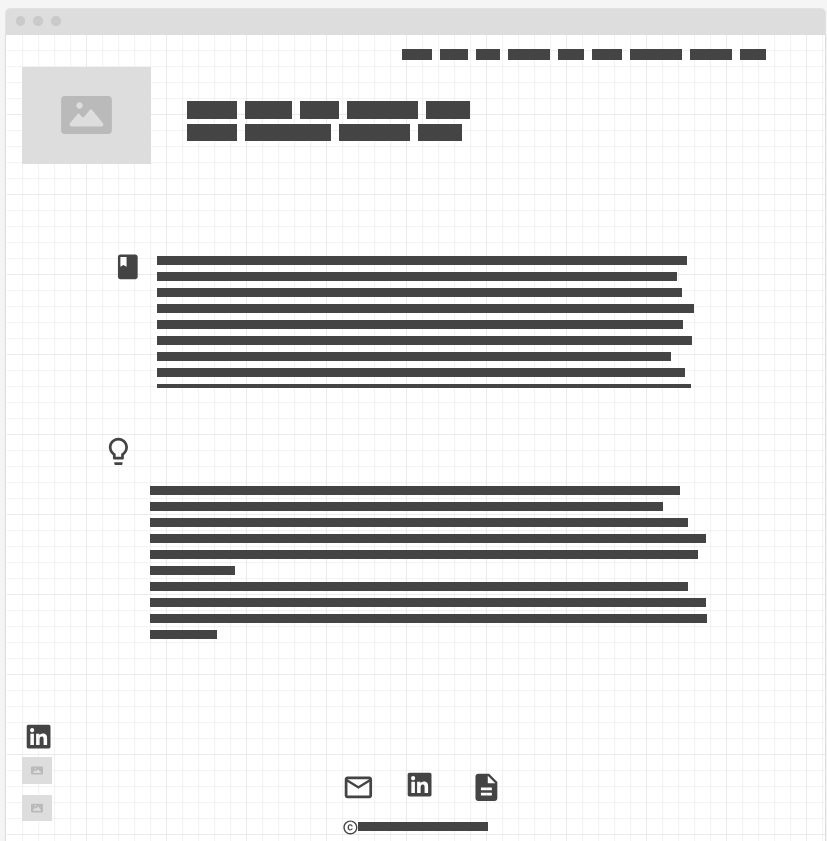

## Portfolio personal Pablo Vega

### Propósito

El propósito de este proyecto es crear mi portfolio personal, para poder introducirme a las empresas con un ejemplo de lo que sé hacer junto con toda la información necesaria sobre mí.

### Página principal

En la parte superior, aparecerá mi imagen de perfil arriba a la izquierda, junto a una breve descripción sobre mi. A la derecha estarán los enlaces al resto de apartados de la web.
El primer apartado de la web será mi formación académica, con mis estudios, cursos, etc.

Más abajo, estará el apartado de Skills, donde estarán todas las tecnologías que se utilizar (lenguajes, frameworks...)

En la parte inferior izquierda de la web habrán enlaces de mi perfil de LinkedIn, GitHub y un enlace de contacto para enviarme un e-mail.

En el footer de la web habrá enlaces para enviarme un e-mail, mi perfil de LinkedIn, un enlace de descarga para ver mi CV y abajo del todo copyright

### Página secundaria (Proyectos)

En la parte superior aparecerá el texto "Proyectos personales", junto con los enlaces a los apartados de la página principal.

En la parte izquierda aparecerá una captura del proyecto, junto con el nombre y una breve explicación de las tecnologías utilziadas en éste a su derecha.

Al igual que en la página principal, abajo a la izquierda habrán enlaces a mi LinkedIn, GitHub y para enviarme un e-mail.

En el footer habrá enlaces para enviarme un e-mail, mi perfil de LinkedIn, un enlace de descarga para ver mi CV y abajo del todo copyright

### Página principal versión móvil

En la parte superior derecha hay un desplegable, donde estarán los accesos directos al resto de apartados.

Más abajo estará mi foto de perfil, junto con una breve descripción sobre mi justo abajo de la foto.

Luego estarán los apartados de formación académica y más abajo el apartado de skills.

Abajo a la izquierda estarán los enlaces a mi e-mail, LinkedIn y Github, al igual que en el footer, junto con el apartado del copyright.

### Página secundarios (Proyectos) versión móvil

En la parte superior aparecerá el texto "Proyectos personales", junto con un desplegable que contendrá los enlaces a los apartados de la página principal.

En el resto de la web estarán los proyectos, con un titulo (nombre del proyecto) en la perte superior, una imagen del proyecto abajo y una breve explicación de las tecnologías utilziadas en éste.

Del mismo modo que en el resto de las páginas, abajo a la izquierda habrán enlaces a mi LinkedIn, GitHub y para enviarme un e-mail.

En el footer habrá enlaces para enviarme un e-mail, mi perfil de LinkedIn, un enlace de descarga para ver mi CV y abajo del todo copyright

